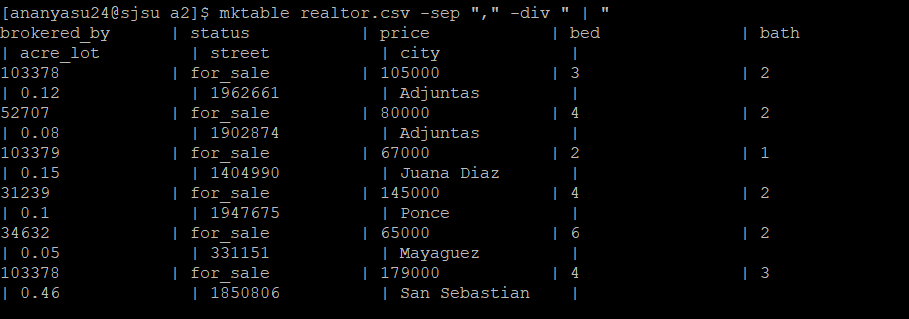

# Custom command 'mktable'

Inspired from the first assignment and pandas, mktable can be used be provided with a csv or tsv file. User can specify a the separator used in the file.

## Usage

```bash
mktable <file> -sep <separator> -div <divider>
```
## Main Function

Use the package manager [pip](https://pip.pypa.io/en/stable/) to install foobar.  
1. Main function is defined to take with 3 arguments.

  ```bash
  mainfunc(){
      local file=$1
      local separator=$2
      local divider=$3
  ```
  
2. Check if the separator is `,` or `\t`. For example, if it is a `,` awk is used to set the field separator and assign the `$divider` to the variable div.

```bash
   if [[ "$separator" == "," ]]; then
        awk -F, -v div="$divider"'
```

3. The for loop iterates through every single field in using awk variable `NK` (Number of fields).
TThe entries are left aligned with a space of 16 characters and then printed alongside the user defined devider.

```bash
        {
            for (i = 1; i <= NF; i++) {
                printf "%-16s%s", $i, div;
            }
            printf "\n";
        }' "$file"

```
An error is printed when any other separator is used.

```bash
    else
        echo "Sorry! can only work with comma or tab separated files."
    fi
}
```

## Checking for problems

If the number of arguments is not 5, it prints a usage message and exits with status 1 (indicating an error). The same functionality is repeated for checking for `-sep` and `-div`. 

```bash
#When correct input not provided
if [[ $# -ne 5 ]]; then
    echo "Usage: $0 <file> -sep <separator> -div <divider>"
    echo "Separators allowed are ',' or '\t'."
    exit 1
fi

# Checkfor -sep and -div

if [[ "$2" != "-sep" || "$4" != "-div" ]]; then
    echo "Usage: $0 <file> -sep <separator> -div <divider>"
    echo "Separators allowed are ',' or '\t'."
    exit 1
fi
```
Finally mainfunc is executed.
```bash
mainfunc "$1" "$3" "$5"
```

## Future work

- The text does not wrap around properly with when there are many columns, this can be worked upon.
  
- More separators such as space, carriage return, line break, form feed, vertical tab can be included.
- Headers can be specified more clearly
